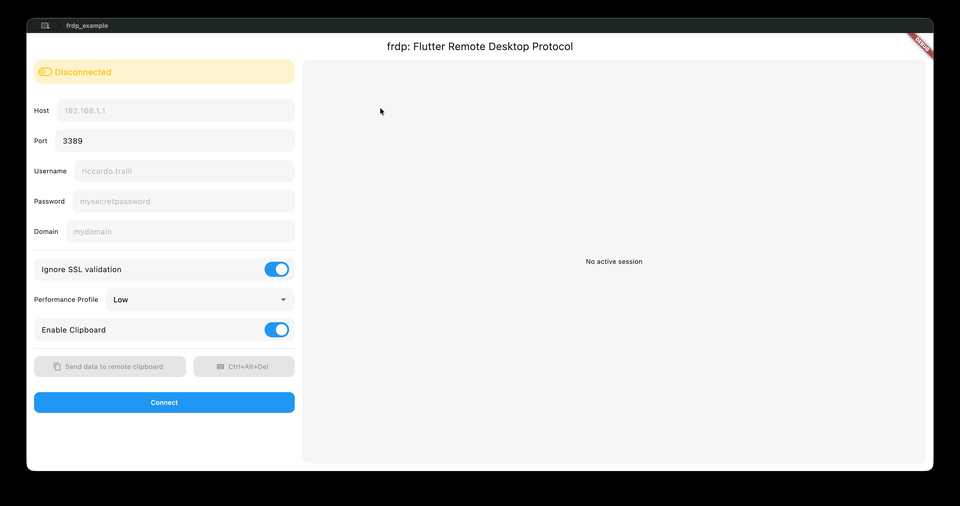

# frdp

[](https://dart.dev)
[](https://flutter.dev)

[](https://github.com/riccardo-tralli/frdp)
[](https://github.com/riccardo-tralli/frdp)
[](https://github.com/riccardo-tralli/frdp)

A Flutter plugin for Remote Desktop Protocol (RDP) connections.

`frdp` features:

- A Dart API to open and manage RDP sessions.
- A native macOS platform view widget to render the remote desktop in Flutter.
- Input forwarding for keyboard, mouse, and touchpad events.
- Support for GDI and GFX rendering backends.



## ‼️ Development status (Early Stage) ‼️

This project is **early-stage / experimental**.

- API changes can be breaking, even in minor updates.
- Method-channel contract details may evolve while the plugin matures.
- Current production readiness should be evaluated carefully per use case.

If you adopt `frdp` now, pin a specific commit or version and test upgrades before rollout.

## Platform support

- macOS: supported ✅
- Windows: planned 🗓️
- Linux: planned 🗓️
- iOS: not planned ❌
- Android: not planned ❌
- Web: not planned ❌

## Installation

Add the dependency to your `pubspec.yaml`.

### From GitHub

```yaml
dependencies:
    frdp:
        git:
            url: https://github.com/riccardo-tralli/frdp.git
            ref: main
```

### From local

```yaml
dependencies:
    frdp:
        path: ../frdp
```

Then run:

```bash
flutter pub get
```

## Quick start

Import the package:

```dart
import "package:frdp/frdp.dart";
```

Create a plugin instance and connect:

```dart
final frdp = const Frdp();

final session = await frdp.connect(
  const FrdpConnectionConfig(
    host: "192.168.1.1",
    port: 3389, // optional, default 3389
    username: "rdp-user",
    password: "rdp-password",
    domain: "WORKGROUP", // optional
    ignoreCertificate: true, // optional, default false
    renderingBackend: FrdpRenderingBackend.gdi, // optional, default gdi
    performanceProfile: FrdpPerformanceProfile.medium, // optional, default medium
    connectTimeoutMs: 15000, // optional
  ),
);
```

Use a custom profile when you need fine-grained control over FreeRDP settings:

```dart
final session = await frdp.connect(
  const FrdpConnectionConfig(
    host: "192.168.1.1",
    username: "rdp-user",
    password: "rdp-password",
    renderingBackend: FrdpRenderingBackend.gfx,
    performanceProfile: FrdpPerformanceProfile.custom,
    customPerformanceProfile: FrdpCustomPerformanceProfile(
      desktopWidth: 1920,
      desktopHeight: 1080,
      connectionType: FrdpConnectionType.lan,
      colorDepth: 32,
      disableWallpaper: false,
      allowFontSmoothing: true,
      gfxH264: true,
      gfxAvc444: true,
    ),
  ),
);
```

Render the remote desktop in your widget tree:

```dart
FrdpView(sessionId: session.id)
```

Disconnect when done:

```dart
await frdp.disconnect(session.id);
```

## FreeRDP Library

The plugin builds and caches [FreeRDP](https://github.com/FreeRDP/FreeRDP) from source automatically. FreeRDP is expected to be provided through this embedded bootstrap flow rather than through a preinstalled package manager copy.

Default behavior:

- During `pod install` / first macOS build, `macos/scripts/ensure_embedded_freerdp.sh` clones FreeRDP from the official repo and builds static libraries.
- Build artifacts are cached in `macos/.freerdp/install` and reused on subsequent builds.
- Dependencies are also built and cached in `macos/.freerdp/deps/install` by default.
- The embedded build disables standalone FreeRDP desktop clients such as SDL/X11, WinPR helper executables, and optional media codec stacks like Opus/FFmpeg, keeping only the libraries/channels needed by the plugin.

Build prerequisites:

- `git`
- `cmake`
- `ninja` (optional, for faster builds)
- `curl`, `perl`, `make` (required to build embedded OpenSSL)

Useful environment variables:

```bash
# Pin to a specific upstream ref/tag/branch
export FREERDP_GIT_REF=3.24.2

# Change repo (fork/mirror)
export FREERDP_GIT_URL=https://github.com/FreeRDP/FreeRDP.git

# Architecture to build into the static libraries
export FREERDP_ARCH="arm64"

# macOS deployment target for the embedded static libraries and pod target
export FRDP_MACOS_DEPLOYMENT_TARGET=10.15

# Embedded OpenSSL version
export OPENSSL_VERSION=3.3.2

# Embedded jansson source/ref
export JANSSON_GIT_URL=https://github.com/akheron/jansson.git
export JANSSON_GIT_REF=v2.14
```

## Public API overview

Main exports:

- `Frdp`: API client (`connect`, `disconnect`, state checks, input forwarding)
- `FrdpConnectionConfig`: connection settings and validation
- `FrdpSession`: session identifier and current state
- `FrdpConnectionState`: `disconnected`, `connecting`, `connected`, `error`
- `FrdpRenderingBackend`: rendering backend (`gdi`, `gfx`)
- `FrdpPerformanceProfile`: preset profile for connection quality/performance trade-offs
- `FrdpCustomPerformanceProfile`: fine-grained FreeRDP display/performance settings
- `FrdpConnectionType`: link-type hint used by custom profile
- `FrdpView`: RDP rendering widget

## Input forwarding

`frdp` forwards:

- Pointer events (`x`, `y`, `buttons` bitmask)
- Key events (`keyCode`, `isDown`)

The pointer `buttons` bitmask follows Flutter conventions:

- `1`: left button
- `2`: right button
- `4`: middle button
- `8`: back button
- `16`: forward button

## Method-Channel Contract Tool

The plugin uses a generated channel contract to keep Dart and native implementations aligned.

- Source of truth: `tool/channel_contract.json`
- Generated Dart file: `lib/src/channel/frdp_channel_contract.dart`
- Generated macOS file: `macos/Classes/plugin/FrdpChannelContract.swift`
- Generator: `tool/generate_channel_contracts.dart`

### Maintenance

Do not edit files manually. Update `tool/channel_contract.json` and regenerate contract files:

```bash
dart tool/generate_channel_contracts.dart
```

## Example app

A working example app is available in [example](example).

Run it with:

```bash
cd example
flutter pub get
flutter run -d macos
```

## License

`frdp` is distributed under the MIT License. See [LICENSE](LICENSE).
